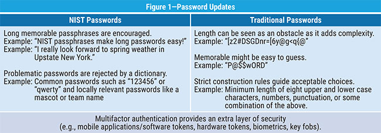

**Company.com**

**Information Security Policies**

**Updated: 2021**

# PURPOSE

This company relies on the trust of its customers, partners, staff, and investors to be successful. In order to maintain that trust the company has established these security policies to ensure a common set of expectations that facilitate our security goals.

# AUDIENCE

## Internal

These policies apply to all employees of the company. Employees are required to review and attest to policy adherence on an annual basis to retain their employment. Employees are required to report any violation or lapse of policy to the company as soon as possible after discovery.

## External

While performing work for the company these policies apply to all contractors, volunteers, temporary help and interns. If you have questions about a policy you are required to contact your sponsor for clarification. If you discover a violation or lapse in a policy you are required to report it to the company as soon as possible after discovery.

# SCOPE

These policies apply to all information security activities for all offices, data centers and operating environments for the Company worldwide without exception.

# ACCEPTABLE USE

Company equipment, facilities and networks may only be used to support the company interests. Users of company equipment are responsible for ensuring that their activities properly protect the company interests and do not endanger the company.

Users of the company’s information systems must:

* Refrain from activities unrelated to appropriate company functions, except in a purely incidental manner.

* Refrain from attempting to gain unauthorized access to information resources or enabling unauthorized access.

* Not attempt any illegal, fraudulent, obscene, threatening or harassing activity

* Ensure their systems are backed up to company-approved data stores

* Not attempt to tamper with, disable or bypass security controls

* Not attempt to tamper with, disable or bypass data integrity or retention controls

* Ensure the systems they operate follow the company’s vulnerability management practices.

* Refrain from using personal accounts to perform company duties or interact with company data.

The audience for this policy understands they expect no right to privacy on company networks, or when using company equipment or resources. The company reserves all rights to inspect company owned or operated devices, networks and systems.

# CREDENTIAL MANAGEMENT

Users of the company’s information systems must:

* Ensure that any initial credentials you are provided for initial use are rotated upon first use

* Ensure their assigned accounts are protected and used solely by them, not shared and not exposed to unauthorized risk

* Ensure that credentials they steward for company services (TLS certs, API keys, AWS access keys, etc) are properly protected and not exposed to unauthorized risk through activities such as sending via email/chat, storing in plain text, hard coding in programs, etc.

* Ensure that multi-factor authentication is used whenever possible

* Rotate any credentials that have a suspicion of being compromised

* Ensure that access to credentials is limited to those required to perform their duties

* Ensure that memorized credentials (passwords/passphrases) are complex and follow [NIST SP 800-63-3](https://nvlpubs.nist.gov/nistpubs/SpecialPublications/NIST.SP.800-63b.pdf) standard as follows:

    * **Composition**: 3 or more **_words_** (not letters)

    * **Character types**: Nonstandard characters, such as emoticons, are allowed when possible. Spaces and punctuation in passphrases are encouraged

    * **Reset/Rotation**: Required only if the password is compromised or forgotten

    * **Multifactor**: Used wherever possible

# ACCESS CONTROL

Users and administrators of the company’s information systems must:

* Ensure that access is granted and used on a least privilege basis, allowing access to only the resources needed to perform their duties

* Ensure that unused access is revoked when it is no longer required (examples;  change in job duty, termination of relationship with the company)

* Ensure that service/function accounts used by non-person operations are limited in scope to the permissions required for the service and nothing more.

* Ensure that service/function accounts do not rely on or re-use the credentials of a person

* Ensure that when interacting with a service they are not utilizing service/function accounts, but rather are using individual accounts provided by the company that properly identify their actions

* Ensure that default accounts included in information systems are either disabled or properly secured with strong credentials

* Ensure that any account unlock is performed in accordance with company procedures for proper identification, audit logging and reporting

# DATA RETENTION

Users and administrators of the company’s information systems must:

* Ensure that data in documents, messages, data stores and other repositories is accessible to the company when required

* Ensure that data in documents, messages, data stores and other repositories is destroyed according to company guidelines when that data is set to expire

* Not circumvent controls designed to ensure data integrity, backup data or remove data

# VULNERABILITY REMEDIATION

Users and administrators of the company’s information systems must:

* Ensure that the systems they operate are fully patched and utilize up to date software.

* Ensure that vulnerabilities are remediated according to the following schedule:

    * **MAX RISK**: Immediate patching

    * **HIGH RISK**: Patch within 30 days

    * **MEDIUM RISK**: Patch within 60 days

    * **LOW RISK**: Patch within 90 days

* Ensure that wherever possible systems should be set to utilize auto-update mechanisms

* Not bypass software update mechanisms

* Not ignore software updates

# PROCUREMENT

New hardware and software purchases must adhere to existing standards/contracts or be vetted for legal, contractual and technical compatibility prior to being pursued.

Users and administrators of the company’s information systems must:

* Not enter into unauthorized use of a system or service that has not been procured by the company

* Not circumvent controls prohibiting use of systems or services disallowed by the company

# VPN/REMOTE ACCESS

The company may at its own discretion choose to employ VPNs or other remote access technologies.

Users and administrators of the company’s information systems must:

* Make use of VPN/Remote access systems when offered

* Make no attempt to circumvent or bypass VPN/Remote access systems

* Not expose systems shielded by the protection of VPN/Remote access controls

* Not connect unapproved networks using VPN or other networking technologies

* Ensure that external third party remote access is revoked when not needed

# CHANGE MANAGEMENT

In order to provide the uptime and availability of our systems, the company may choose to implement change management processes, procedures and supporting technologies.

It is the responsibility of this audience to:

* Abide by the change management processes

* Not attempt to circumvent change management controls, especially when interacting with production systems

* Ensure that new systems and environments are consistent with established change management controls

# BUSINESS CONTINUITY

The company has chosen a cloud-first, SaaS approach to its operations. In order to ensure business continuity it is the responsibility of this audience to:

* Ensure that existing system continuity is not degraded through unapproved use of technologies or systems

    * Examples include but are not limited to:

        * Unapproved use of a cloud vendor

        * Unapproved use of a region within the approved cloud vendors

        * Unapproved use of a service within the approved cloud vendors

        * Unapproved use of a locally hosted or  on-premise system

        * Use of an unapproved SaaS vendor or vendor integration

        * Unapproved use of an unlicensed, unsupported or end of life technology

* Not bypass or disable any existing business continuity procedures, processes or technologies

* Ensure that business continuity concerns are properly addressed in the design and implementation of new systems as well as the ongoing operation/expansion of existing systems.

* Ensure that you are familiar with the business continuity procedures

* Ensure that you conduct continuity testing as prescribed by the company procedures

* Ensure that your operations comply with the business continuity procedures

* Ensure that the systems you operate are deployed with sufficient monitoring and capacity to comply with the demands of processing and delivery.

# ATTESTATION

I attest that I have read, understood and will be bound by these policies:

Signature: ____________________________

Date:      ____________________________

