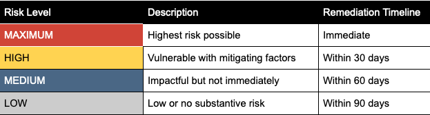
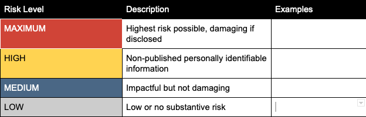

# Vulnerability Management Program
Identifying and resolving vulnerabilities in our systems, applications or underlying libraries is accomplished through the use of several processes.

*identify the processes used in your organization to identify and remediate vulnerabilities (ci/cd systems, vuln scanners, etc)*

## Vulnerability Risk Ratings and Mitigation Timelines
The company uses the [Mozilla standard risk rating](https://infosec.mozilla.org/guidelines/risk/standard_levels#standard-risk-levels-definition-and-nomenclature) system to classify and mitigate vulnerabilities as follows:

# Data Security
## Data Classification
The company handles a variety of data while servicing the needs of our customers. We use the same risk-based classification system to identify the risks associated with the data.

The most sensitive data stored within the application is as follows:
 * element #1
 * element #2
 * etc.

## Data Threat Model
### Spoofing
An example of identity spoofing is illegally accessing and then using another user's authentication information, such as username and password. If user passwords were disclosed or guessed, threat actors could operate as a user and gain access to private details.

*include specific examples or recommendations for your org here*

### Tampering
Data tampering involves the malicious modification of data. If user data was modified, users would lose faith in the integrity of the company.

*include specific examples or recommendations for your org here*

### Repudiation
Repudiation threats are associated with users who deny performing an action without other parties having any way to prove otherwise.

*include specific examples or recommendations for your org here*

### Denial of Service
Denial of service (DoS) attacks usually operate through resource exhaustion, denying service to valid users.

*include specific examples or recommendations for your org here*

### Elevation of Privilege
In this type of threat, an unprivileged user gains privileged access and sufficient access to compromise, access or destroy parts of the system or the accounts within it.

*include specific examples or recommendations for your org here*
